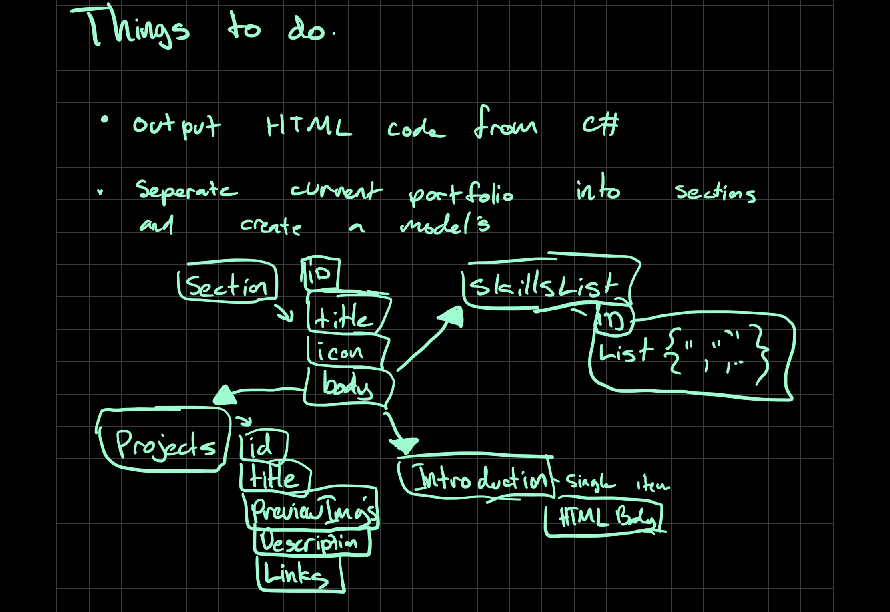

My Portfolio port Case Study for .Net
Heroku App : https://alfred-quezada.herokuapp.com/

To understand more in depth how to program in c# I decided to port my bootstrap JavaScript portfolio, into a .Net Web App project.
This would give me a very base understanding of where and how .Net does its magic on and with the HTML   

I wanted to understand more in depth specifically on how to merge the Hypertext Markup Language with the .Net enviornment. 
I like to think that I had a good grasp of HTML and Javascript frameworks, as well as C# from programming Unity C# projects. Even then
I was not too familiar with how the two interlinked. My first commit is the closest I could get to copy paste, from here 
I started  with creating lists of skills using the String Type. With that I was able 
to manipulate the web ui from an c# level, and my first real step and commit to this github repo. 

From here I needed to try to disect the boot strap page into sections that I could base around models. I sketched out my desgins
to demonstrate how I could seperate the sections into variables and other models. This gave me a good understanding of the Models 
relationship in the .Net framework. AQ 7/22/22

Figure 1. Sketch of bootstrap portfolio break down.  Alfred Q. 7/22/22
